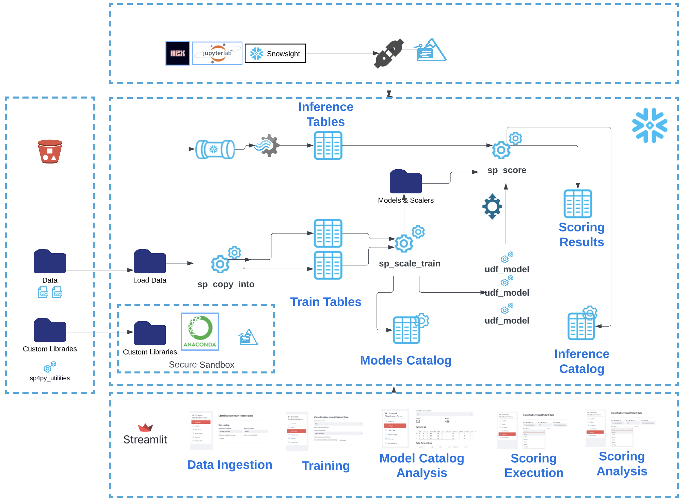
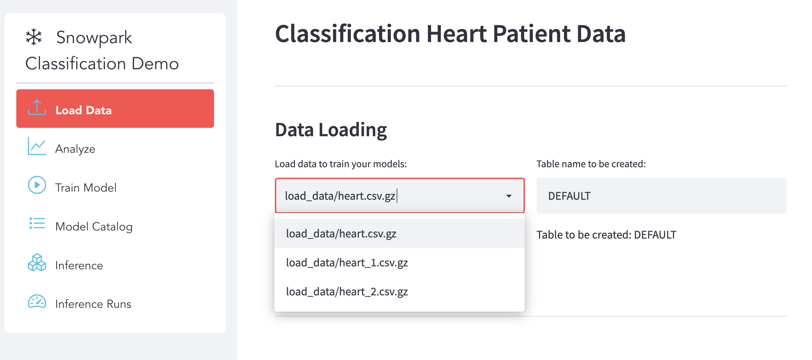
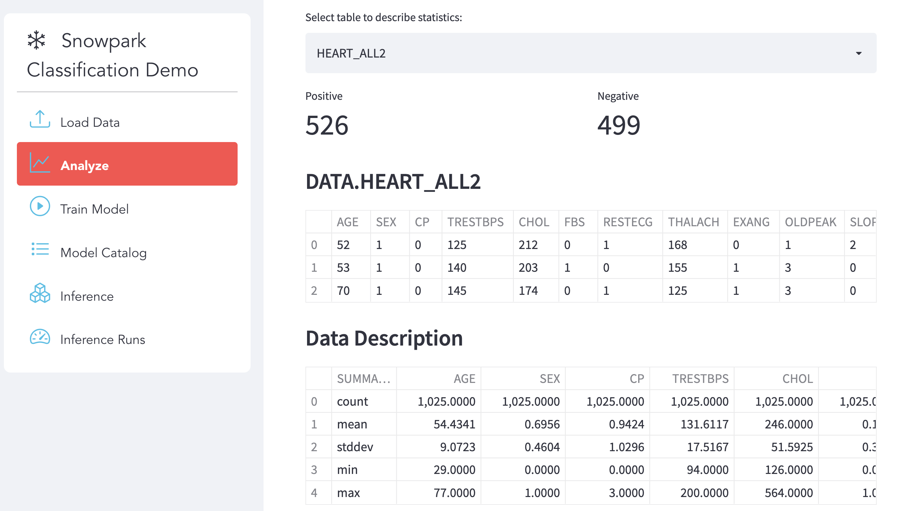
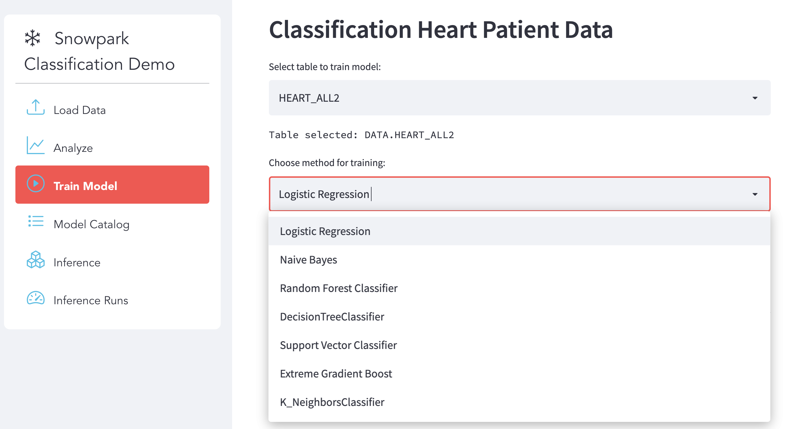
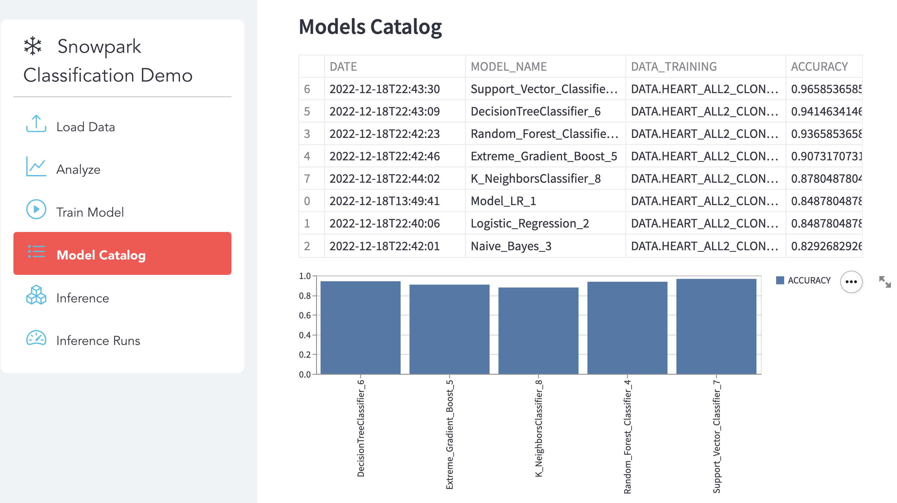
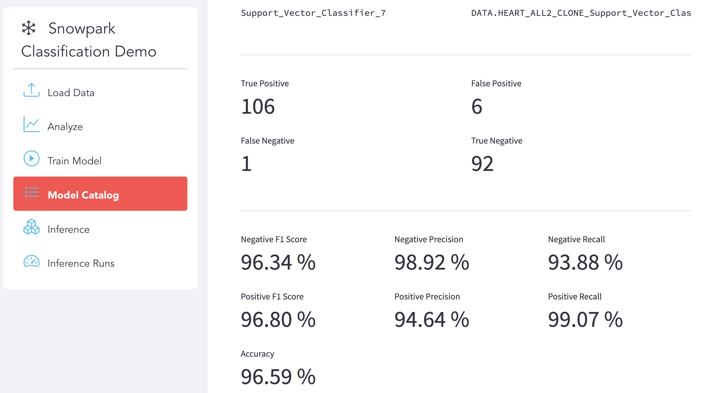
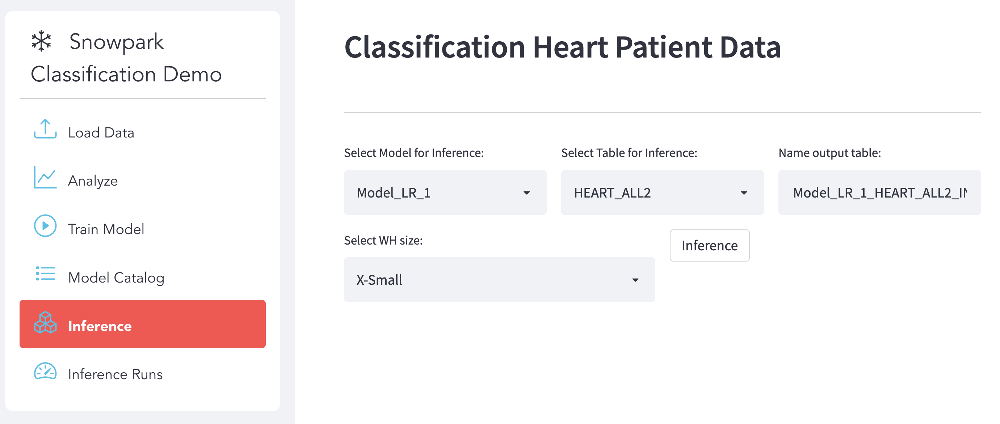
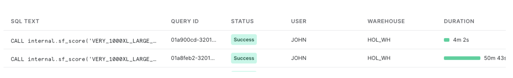
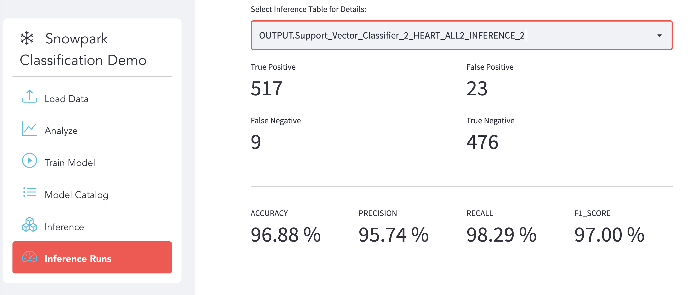

# ML Classification with Snowpark Python

This repository shows how to implement a framework to run several classification algorithms with Snowpark. It is based on Heart Disease Dataset obtained from  https://www.kaggle.com/datasets/johnsmith88/heart-disease-dataset. It provides examples on refactoring from code like https://www.bmc.com/blogs/python-spark-machine-learning-classification run in Spark into Snowpark.

Because all the functions needed are implemented as Stored Procedures and User Defined Functions, the entire logic runs within Snowflake using Snowpark for Python.

This diagram shows the arquitecture proposed:

It implements at Streamlit App like this:

https://user-images.githubusercontent.com/71042077/210391741-734bf056-abaf-4be1-b1d4-46c04eeb8f7f.mp4

## Prerequisites

* Create one [Snowflake account](https://signup.snowflake.com/) if you do not have one available.

## Setup
Run these steps to get the Snowflake create the database that will be used, the stored procedures and the Streamlit App

### **Step 1** -- Clone Repo

* `git clone https://github.com/Snowflake-Labs/snowpark-python-demos` OR `git clone git@github.com:Snowflake-Labs/snowpark-python-demos.git`

* `cd ML-Heart-Attack-Prediction`

### **Step 2** -- Create And Activate Conda Environment

* Note: You can download the miniconda installer from
https://conda.io/miniconda.html. OR, you may use any other Python environment with Python 3.8

File conda_env.yml containes all the packages that will be needed.

* `conda env create -f conda_env.yml`

* `conda activate pysnowpark-ml-streamlit`

If using Jupyter Notebook and you do not have a kernel available you can install one:

* `python -m ipykernel install --user --name=pysnowpark-ml-streamlit`

### **Step 3** -- Update [creds.json](creds.json) with your Snowflake account details and credentials

* Note: For the **account** parameter, specify your [account identifier](https://docs.snowflake.com/en/user-guide/admin-account-identifier.html) and do not include the snowflakecomputing.com domain name. Snowflake automatically appends this when creating the connection.

### **Step 4** -- Run ml-classification Notebook

Use your favourite IDE or run `Jupyter Notebook` and open ml-classification notebook.

It will create all the infrastructure and stored procedures that will be used by the Streamlit App. It also make some testing to verify all is working well.

Be aware that the notebook will create a database called **HEART_DB**. Modify the notebook if needed.

### **Step 5** -- Run the streamlit app

Run the streamlit app by executing:

`streamlit run app_heart.py`

## Streamlit App

The app will help to see how to load, train, review models, score new patient data and review the inference.

### Load Data

The setup notebook creates an internal stage an upload some files that can be used for training and score. These has been downloaded from kaggle. This could also reside in an external staging area. For simplcity, the notebook automates the upload process. Here the user can select what files to use and the table that wants to create.

### Analyze

Once the data has been loaded, this tab allows you to analyze the data statistics. Identify the number of positive and negative cases and some basic statistics. This could be enhanced with much more output using all the ML and statistics packages available within Anaconda repository.

### Train

The Stored Procedure **sf_scaler_train** combines Scaling and Training. It is perfectly possible to use common StandardScaler from sklearn.preprocessing, but in this case we wanted to show Snowpark possibilities bringing more processing down to Snowflake, so we are using custom libraries from https://github.com/snowflakecorp/sp4py_utilities/blob/main/sp4py_utilities_demo_training_scoring.ipynb and the Scaler object is stored within a staging area so we can use it later when scoring.

We just need to select the table we want to use for training and what is the algorithm that will be created. Before training, a clone of the database will be automatically taken and retained so we can use it later if needed. Also we can use the new Snowpark Optimized Warehouses. The App will automatically convert the current warehouse to an optimized one and will revert back to the current confing once the training is complete.

### Models Catalog

All the models trained are stored in a catalog. The scaler and model are kept in a staging area and all the results and metadata in a table. Here we can see all the models currently available and the general performance:

For any of the models we can go deeper into the results obtained during the testing phase of the model:

### Inference

We can select any of the models produced and apply it to any table. This process can be fully automated with streams and tasks. Here we use Streamlit to show the different posibilities.

We can also resize the current warehouse if we want to increase the performance of the socring.

This is one of the benefits of parallel processing of Snowpark for inference with the utilizatio of UDFs. We have created 105M records for testing scoring at large scale. Just resizing the warehosue before running the inference we can see the improve on performance:

Using a X-Small warehouse took around 50 minutes to score those 105M records. Using a 2X-Large warehosue we was able to reduce scoring time to 4 minutes. Using the App we can find what is the sweet spot with the right balance between cost and performance.

### Inference Runs

Finally for each inference that has been run, we can analyze the efficiency of the model on real data if we got true labels for that data. Because the data used for training has been cloned, we keep a copy that can be used later to detect any drift.

