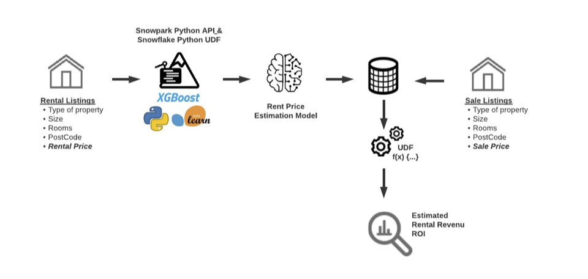
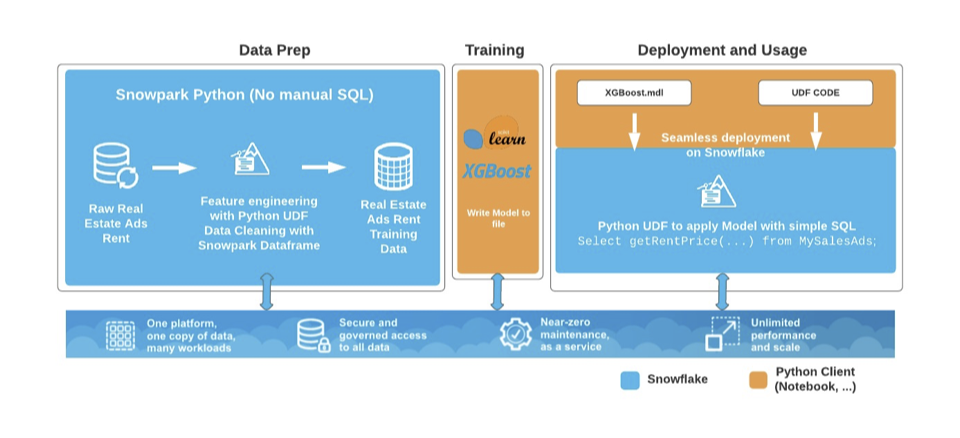

# Machine Learning with Snowpark Python and Java UDFs

## 1. Overview

In this example, you will be able to use Snowpark for Python, along with your favorite python libraries for data analysis and visualization, as well as the popular scikit learn ML library to address an end to end machine learning use case.

Using rental listings we would like to train a ML model to estimate the rent price of our sale listing


### Using rental listings we would like to train a ML model to estimate the rent price of our sale listing : 



### We will use the following architecture to prepare our data, training our XGBoost linear regression model and run our model on Snowflake :




## 2. Prerequisite

* Snowflake account
* Snowpark for Python
* The examples also use the following Python libraries:
   ```
   scikit-learn
   pandas
   xgboost
   matplotlib
   ```
* Jupyter or JupyterLab

## 3. What you'll learn  

- Get an understanding on how to implement an end-to-end ML pipeline using Snowpark for Python.
- Develop using Snowpark for Python API, and Snowpark for Python UDFs.
- Data Exploration, visualization and preparation using Python popular libraries (pandas, matplotlib).
- Machine Learning using scikit-learn python package and Xgboost
- Deploying and using an ML model for scoring in Snowflake using Snowpark for Python.

## 4. Usage/Steps

1. Open terminal and clone this repo or use GitHub Desktop : 

    `git clone https://github.com/Snowflake-Labs/snowpark-python-examples`

2. Change to the `Real Estate Rentability Prediction` directory and launch  JupyterLab

    `jupyter lab`

3. Paste the URL in a browser window and once JupyterLab comes up, switch to the work directory and update `creds.json` to reflect your snowflake environment.

4. Run through the RealEstateRentabilityPrediction_Setup Notebook. This will create the database and tables needed for this demo. 

5. Then you can now run the RealEstateRentabilityPrediction_Demo.

If you are using icetire, throughout this process, if you see errors about Python packages not found in your conda environment, you can simply install them through a pip command directly in the Setup notebook as shown in the Section 2. Python Librairies.
