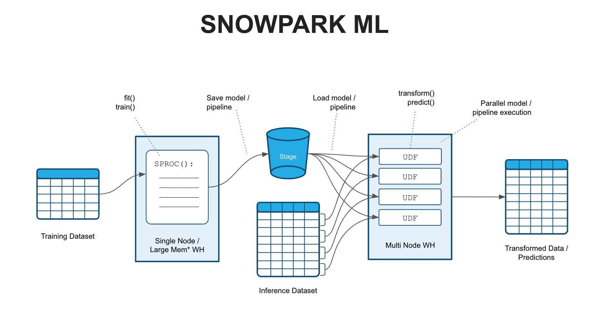
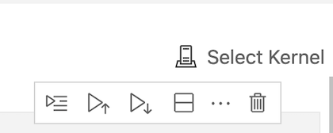

# Snowpark ML Demo

Uses Snowpark Python Stored Procs (SPROCs), User-Defined Functions (UDFs)
and data frame operations for end-to-end Machine Learning in Snowflake.

## Introduction

In this notebook we fit/train a Scikit-Learn ML pipeline that includes common feature engineering tasks such as Imputations, Scaling and One-Hot Encoding. The pipeline also includes a `RandomForestRegressor` model that will predict median house values in California. 

We will fit/train the pipeline using a Snowpark Python Stored Procedure (SPROC) and then save the pipeline to a Snowflake stage. This example concludes by showing how a saved model/pipeline can be loaded and run in a scalable fashion on a snowflake warehouse using Snowpark Python User-Defined Functions (UDFs). 



## 1. Create the Conda Snowpark Environment

1.1 Clone the repository and switch into the directory

1.2 Open `environment.yml` and paste in the following config:

```yaml
name: snowpark_ml_test
channels:
  - snowflake
dependencies:
  - python=3.8
  - snowflake-snowpark-python
  - ipykernel
  - pyarrow
  - numpy
  - scikit-learn
  - pandas
  - joblib
  - cachetools
```

1.3 Create the conda environment

`conda env create -f environment.yml`

1.4 Activate the conda environment

   `conda activate snowpark_ml_test`

1.5 Download and install [VS Code](https://code.visualstudio.com/)

1.6 Update the `creds.json` file with your Snowflake account and credentials

1.7 Configure the conda environment in VS Code

In the terminal, run this command and note the path of the newly create conda environment

    `conda env list`

Open the notebook named `1_snowpark_housing_ingest_data.ipynb` in VS Code and in the top right corner click `Select Kernal`



Paste in the path to the conda env you copied earlier

## 2. Ingest the Sample Dataset into Snowflake

Run the rest of the cells in `1_snowpark_housing_ingest_data.ipynb` to ingest data into Snowflake

## 3. Feature Engineering, ML Training and Model Deployment in Snowflake

Open and run `2_snowpark_end_to_end_ml.ipynb` notebook.
