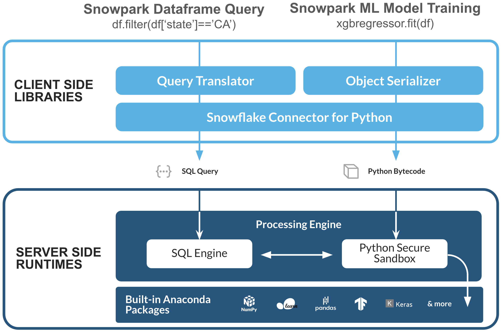

# Snowpark Python - TPC DS  - Customer Lifetime Value

This demo utilizes the [TPC DS sample](https://docs.snowflake.com/en/user-guide/sample-data-tpcds.html) dataset that is made available via  Snowflake share. It can be configured to run on either the 10 TB or the 100 TB version of the dataset.

This illustrates how to utilize Snowpark for feature engineering, model training, and model inference to answer a common question for retailers: What is the value of a customer across all sales channels?

&nbsp;  
## Setup

The TPC DS data is available already to you in your Snowflake account as shared database utlizing Snowflake's data sharing. This means you as the user will never incur the costs of storing this large dataset.

 1. Create a conda environment using the provided *environment.yml* file.
    1. `conda env create -f environment.yml `
    2. Activate that created conda environment by `conda activate pysnowpark_ml_tpcds`
 2. Edit the *creds.json* file to with your account information to connect to your account.
 3. Load Jupyter or equivalent notebook to begin executing the notebook.

&nbsp;  
## Snowpark ML

The Snowflake Summit 2023 was abuzz with excitement, the focal point of which was the announcement of Snowpark ML. This innovative suite, consisting of SDKs and infrastructure tools, aims to streamline the process of building and deploying machine learning models.

Snowpark-ML enables data scientists to write code similar to what they would in popular libraries such as Scikit-Learn or XGBoost, but with a crucial difference as compared to the previous approach in Snowflake - it enables preparing data and building machine learning models with a significant reduction in the amount of boiler plate code required.

With Snowpark-ML, you can leverage snowflake.ml.modeling.preprocessing and snowflake.ml.modeling for transformation and training. The **.fit()** method of a transformer, like OneHotEncoder, or an algorithm, like XGBRegressor, facilitates computation pushdown to Snowflake, significantly simplifying the process of machine learning model building.

Notably, the pre-processing functions like **.filter()** utilize Snowflake's SQL engine for distributed multi-node execution, effectively handling large amounts of data without running into memory or computational challenges. The algorithms available are identical to those in established libraries such as Scikit-Learn, XGBoost, and LightGBM, but executed securely within Snowflake's Python sandbox.  

_
 
_

**Before (Model Training):** Prior to Snowpark ML, our standard process for model training involved creating a stored procedure.

**Before (Model Inference):** Prior to Snowpark ML, our standard process for model inference involved creating and using UDF (user defined functions).

**After:** With Snowpark-ML, data scientists can now write code in a similar vein to popular libraries such as Scikit-Learn or XGBoost, with all heavy computations occurring within Snowflake.

This advancement represents a dramatic reduction in complexity and an increase in security, demonstrating the promise of Snowflake's ongoing evolution.

Snowpark ML Modeling is a collection of Python APIs for preprocessing data and training models. Snowpark ML lets you:
1. Transform your data and train your models without moving your data out of Snowflake.
2. Work with APIs similar to those you’re already familiar with, such as scikit-learn.
3. Keep your ML pipeline running within Snowflake’s security and governance frameworks.
4. Take advantage of the performance and scalability of Snowflake’s data warehouses.

The Snowpark ML Modeling package described here provides estimators and transformers that are compatible with those in the scikit-learn, xgboost, and lightgbm libraries. You can use these APIs to build and train machine learning models within Snowflake.

To learn more about Snowpark ML, see the medium article-
https://medium.com/snowflake/snowpark-ml-a-machine-learning-toolkit-for-snowflake-4119b0bf204

For a quick introduction to Snowpark ML Modeling, see our Quickstart -
https://quickstarts.snowflake.com/guide/intro_to_machine_learning_with_snowpark_ml_for_python/#0

&nbsp; 